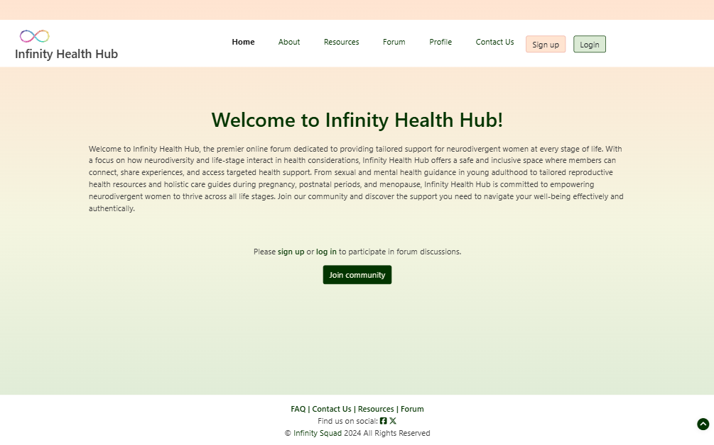
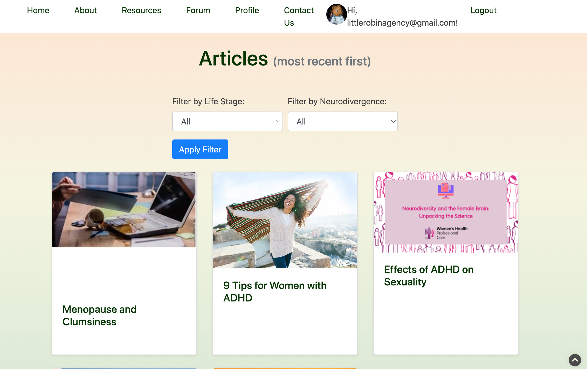
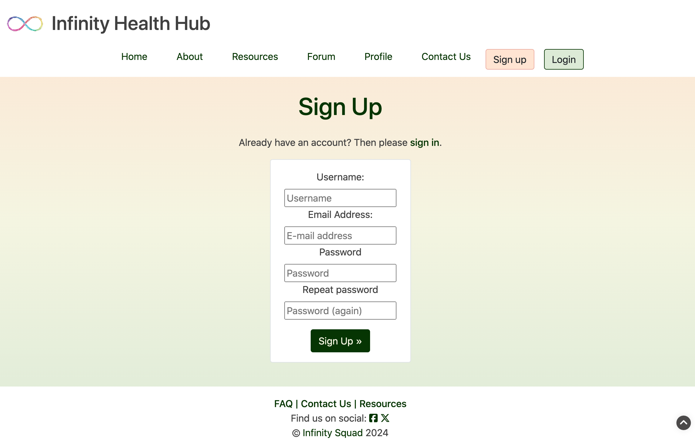
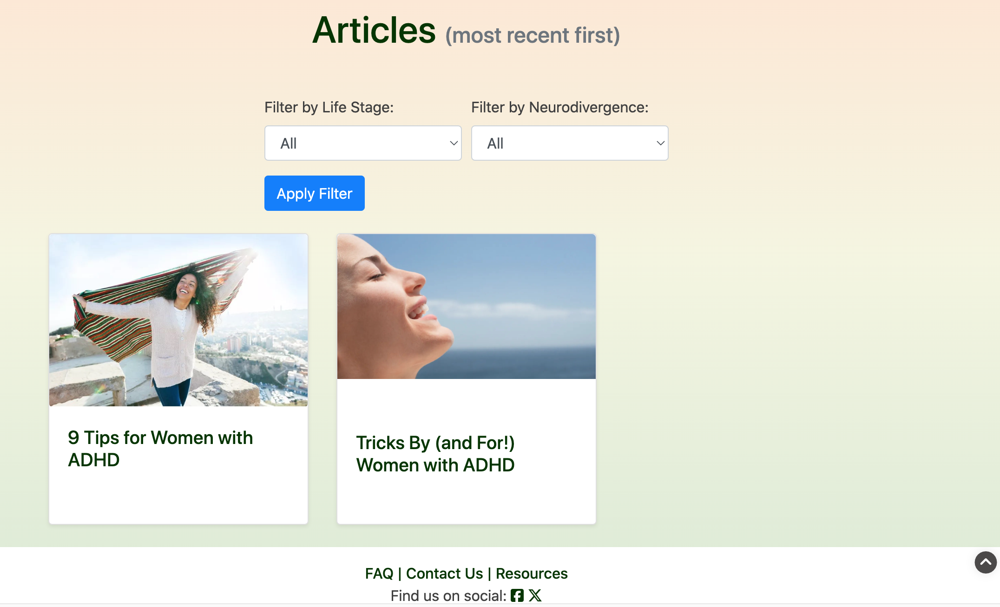
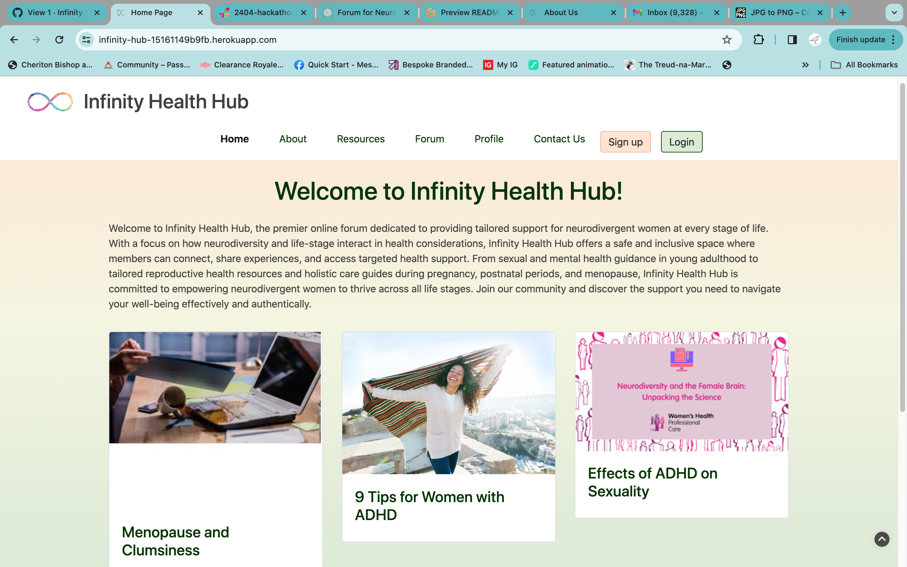

# Infinity Hub 
Developer:  **Team Infinity**, Apr 2024

# Table of Contents:
1. [About](#about)
2. [Project Goals: ](#project-goals)
    1. [UX Design - Strategy ](#ux-design-strategy) 
    2. [UX Design - Strategy - Competitor Portals](#ux-design-strategy-analysis-of-competitors)
    3. [UX Design - Strategy - Target Audience](#ux-design-strategy-target-audience)
3. [UX Design - Scope](#ux-design-scope)
    1. [UX Design - Scope - User Requirements and Expectations](#ux-design-scope-user-requirements-and-expectations)
    2. [UX Design - Scope - Data](#ux-design-scope-data)
    3. [UX Design - Scope - Viewing Device](#ux-design-scope-viewing-device)
4. [User goals/ user stories: ](#user-goals-user-stories)
5. [Further UX Design: ](#ux-design-decisions)
    1. [Skeleton - Wireframes; ](#wireframes)
    2. [Surface - Fonts; ](#fonts-chosen)
    3. [Surface - Colours](#colour-scheme)
    4. [Surface - Imagery](#design-images)
6. [Agile Methology: ](#agile)
    1. [Project setup](#project)
    2. [Designing an Issue Template](#issue-template)
    3. [Kanban board](#kanban-board)
    4. [Observations and learnings](#agile-observations-and-learnings)    
7. [Features](#features)
    1. [Included](#features-in-scope)
    2. [Future Development](#features-left-to-implement)
8. [Technology](#technologies)
    1. [Languages](#langugages)
    2. [Frameworks and Tools](#frameworks--tools)
10. [Accessibility](#accessibility)
11. [Performance](#performance)
12. [Deployment](#deployment)
13. [Credits](#credits)
    1. [Content](#content)
    2. [Media](#media)
    3. [Code](#code)
    4. [References](#references)
    5. [Acknowledgements](#acknowledgements)

## About
---------
Welcome to Infinity Health Hub, the premier online forum dedicated to providing tailored support for neurodivergent women at every stage of life. With a focus on how neurodiversity and life-stage interact in health considerations, Infinity Hub offers a safe and inclusive space where members can connect, share experiences, and access targeted health support. From sexual and mental health guidance in young adulthood to tailored reproductive health resources and holistic care guides during pregnancy, postnatal periods, and menopause, Infinity Hub is committed to empowering neurodivergent women to thrive across all life stages. Join our community and discover the support you need to navigate your well-being effectively and authentically.

This site was created as part of a Code Institute hackathon in conjunction with Trust in Soda, April 2024. 

### Responsiveness
The site is built, with the help of Bootstrap 5, to be fully responsive so it can be used on a range of devices.

Responsive Mockup

### Live webpage link
https://infinity-health-hub-399deb558281.herokuapp.com/

## Problem Statement
----------------
**The problem we aim to solve**:
Neurodivergent women require specialised support due to the distinct challenges they face compared to neurotypical women. Their unique cognitive and sensory experiences impact various aspects of life, including social interactions, self-expression, and healthcare access. Addressing these differences is crucial in fostering inclusive health systems that empower neurodivergent women to navigate their well-being effectively and authentically.

**The concept we’ve put together:**
Supporting neurodivergent women at every stage is vital. Tailored support in young adulthood aids academic and career success. Accessible reproductive health services during attempts to conceive inform family planning. Personalised care during pregnancy and postnatal periods addresses sensory sensitivities and mental health. In menopause, managing hormonal changes alongside existing traits ensures holistic well-being. Meeting these needs fosters inclusive environments where neurodivergent women can thrive across their lives.
By creating a forum that takes neurodiversity, health and life stage into account, the most effective and targeted health support can be provided to all neurodivergent women.

## Project Goals
----------------
1. Provide a clear, informative set of resources on neurodivergent conditions and how these affect females.
2. Filter content to the **users** lifestage and neurodiversity
3. Safe space to allow for progressive reveal rather than abrupt unmasking.
4. Provide a forum for peer-to-peer discussion between site members.
5. Provide moderation to preserve site safety and security for forum discussions
6. Provide an explanation of the InfinityHub ethos and principles.
7. Provide a means for further contact to be made with the site owners.
8. Which uses the capabilities of Django, HTML, CSS and Javascript.
9. And is accessible, responsive and relevant.

### UX Design Strategy
Focus is on abilty for the user to interact with content most relevant to their needs.

### UX Design Strategy Analysis of Competitors
(image here of the competitor analysis from google sheet)

The findings when looking at existing sites (based on search term 'neurodiversity female site' ) was that....

The gaps in their offering are a lack of filterable content,.....

### UX Design Strategy Target Audience
The target audience is females, who are aged 16+, and are living with one or mor neurodivergent conditions 

## UX Design Scope
----------------

## User Goals/ User Stories
----------------

| ID |  **As** | **I want to** | **to achieve** |
| -- |  -- | -- | -- |
| US_01  | site user | quickly understand the site purpose | decide whether to spend time exploring and discovering the site |
| US_02  | site user | easily navigate the site | don't become frustrated and leave |
| US_03  | site user | navigate the site without mandatory login| I can discover site features before deciding whether to commit to using site| 
| US_04  | site user | access resources that are tailored to my lifestage and neurodivergence | avoid information overwhelm| 
| US_05  | site user | set my user profile with my specific lifestage and divergence| receive targeted information by default and avoid overwhelm  | 
| US_06  | site user | decide WHEN and HOW I wish to unmask/reveal my neurodivergence   |  feel safe in sharing/ unmasking at a pace that suits me| 
| US_07  | site user | access a discussion form specific to my lifestage/ neurodivergence | access real-life experiences of people similar to me |
| US_08  | site user | Create a post in a discussion group and retain right to update/ delete post| safely ask questions of peers | 
| US_09  | site user | Add replies to someone elses post | provide helpful information to my peers | 
| US_10  | site user | identify my favourite articles | quickly access them again later | 

| -- | --| --| --|
| SO_01 | site owner | provide a safe, well-moderated space | to support neurodivergent females through challenging stages of life|
| SO_02 | site owner | moderate/approve posts and replies | to retain the site as a safe space for all users |
| SO_03 | site owner | moderate user profile changes  | preserve the privacy of posts to users who share a neurodivergence/lifestage (avoid snoopers) |
| SO_04 | site owner | create and approve articles  | provide authoritative, useful & helpful information to users |

## UX Design Decisions
----------------

### Wireframes
Wireframes were created and used for design agreement

### Fonts Chosen

### Colour Scheme 

### Design Images

## Agile
An Agile approach was followed in plannning and executing this project

### MoSCoW prioritisation

## Features 
Implemented features are   
**F01 Ability to access information Resources as Guest user**
Guest users wishing to learn more about certain conditions or challenges, can view articles (optionally using the lifestage and nuerodivergence filters)  

View site resources

**F01  Lifestage and Neurodiversity personalisation**
The content displayed on the site is personalised to the signed-in users 

Create a user

User Profile maintenance

User Profile maintenance

Article Maintenance

Resources visible to logged in user - before filter applied

Resources visible to users - after filter applied

**F02 Moderated Broadcast Resources - Articles**
Articles are created by the site admin and made available to the users via the Resources page.  
Guest users can see the full range of articles, they can also filter by lifestage and neruodivergence to target their reading.

Homepage - 3 most recent articles

**F03 Private, Moderated peer-to-peer discussions**
Discussion Forum  - posts are created and tagged with specific lifestage(s) and neurodivergences.
These posts are then only visible to users who **match** these lifestage and neurodivergences.
This ensures a level of privacy when reading posts - this allows users to explore sensitive topics with a stakeholder peer group.

Other users have the ability to create replies against the post thread.

Both posts and replies are moderated and will not display until the moderator has approved the entry.

**F04 Progressive Reveal**
As a user who either may not have a formal diagnosis, or who wishes for a level of annonymity when using the site, I can:
* create an 'alias' under which will display (instead of my username) for any posts or comments I create.  This helps as users will often choose their email address as username when signing up to a portal, and this will be overriden by the user's chosen alias.
* create an avatar against my user profile - my initial profile image displays as a generic image, I can choose a representative image - e.g. a cartoon superhero.  As I become more comfortable with the site and its safey, I can decide if I wish to change this to a picture of the 'real me'.

**F06 About Us - Site Mission Statement**

**F07 About Us - Team Profile**

**F08 About Us - FAQ**

**F05 Save articles**
The user has the ability to set a resource as 'saved', to mark articles of interest** so that they create a reading list to conveniently retrieve interesting articles without needing to find again from the main resources page.

### Features in Scope 

### Features Left to Implement

**Access to Follow-on Services**
As a future feature it would make sense for InspireHub to provide access to follow-on resources, being counselling, advocacy bodies and other agencies who could provide 1:1 services.

### Langugages
- HTML 
- CSS
- Javascript
- Python
- Django (V4+)
- Bootrap (V5)

### Frameworks & Tools
* Github:  used to maintain the code repository, and for some readme edits and commits
* Git
* Gitpod:  used for editing and for tracking code commits back to Github

### Python Libraries
A number of additional python libraries were used, the key amongst these being Summernote, which allows for sophisticated article content creation.

### Third-Party Libraries

## Validation 

### HTML Validation 
- HTML
HTML validation was performed for the various site pages as follows:  Render the page via the app, right click on the page contents and take option to copy (rendered) source.  Paste this into a file and subject that file to the W3C validator.  

### CSS Validation

### Performance

### Device Testing

### Multi-browser Testing

### Testing Features

### Bugs and issues

## Deployment

## Credits 
